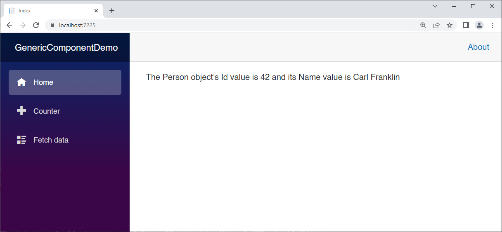
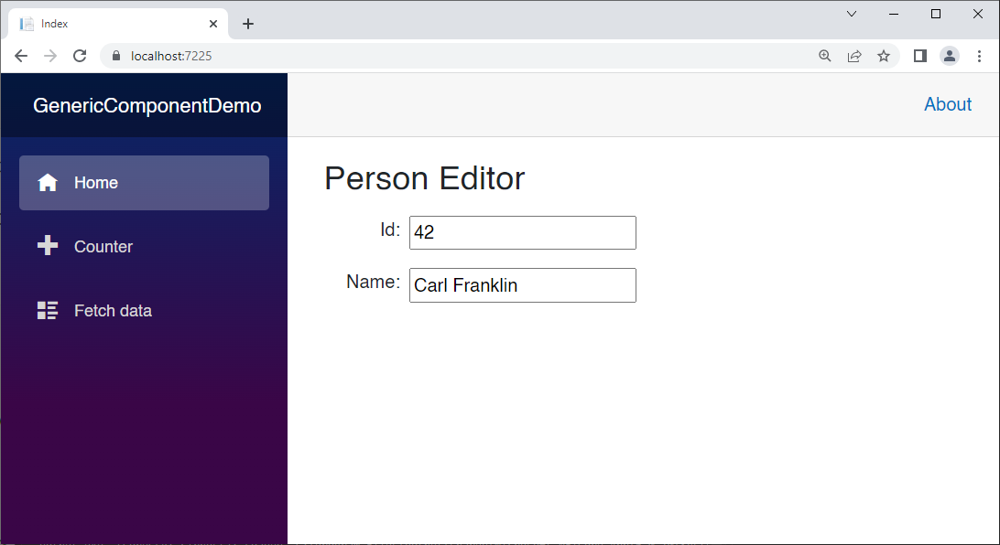
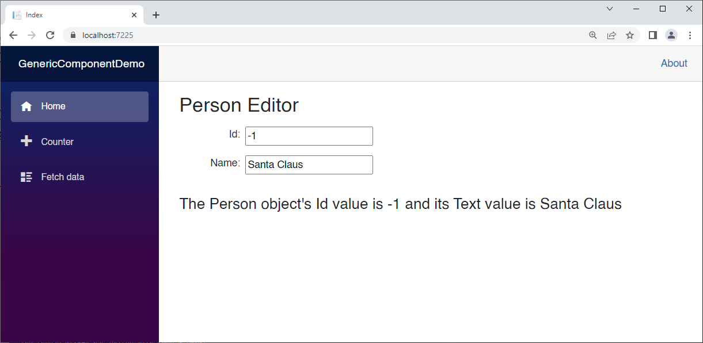
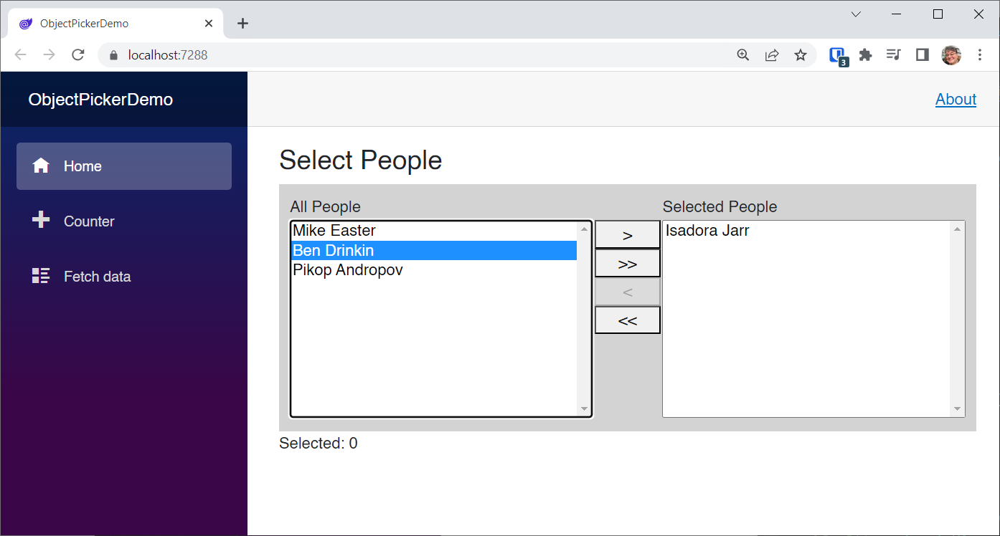
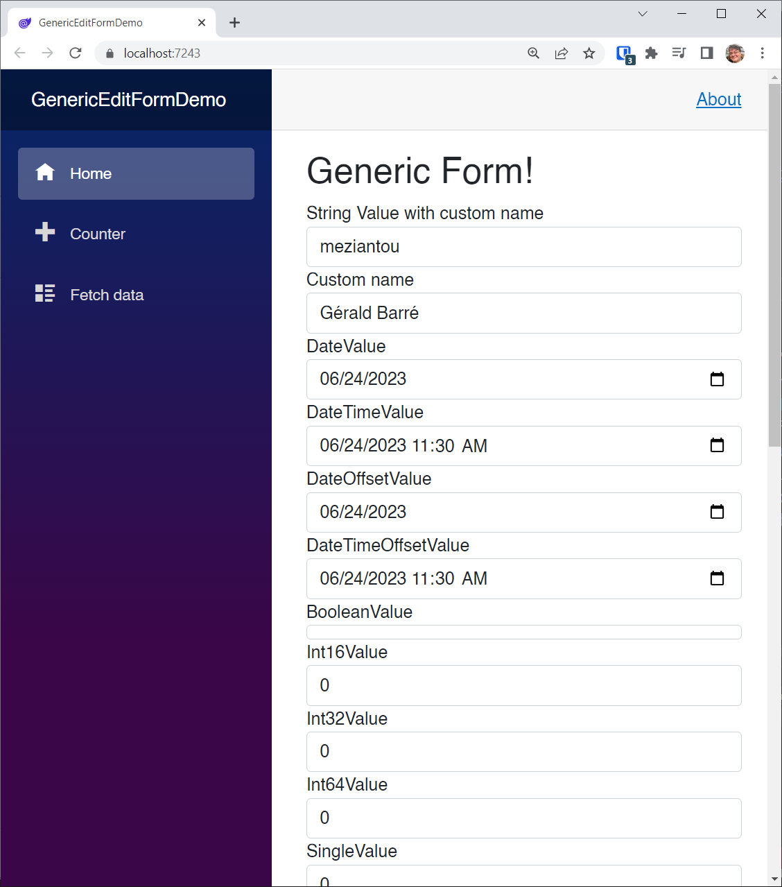
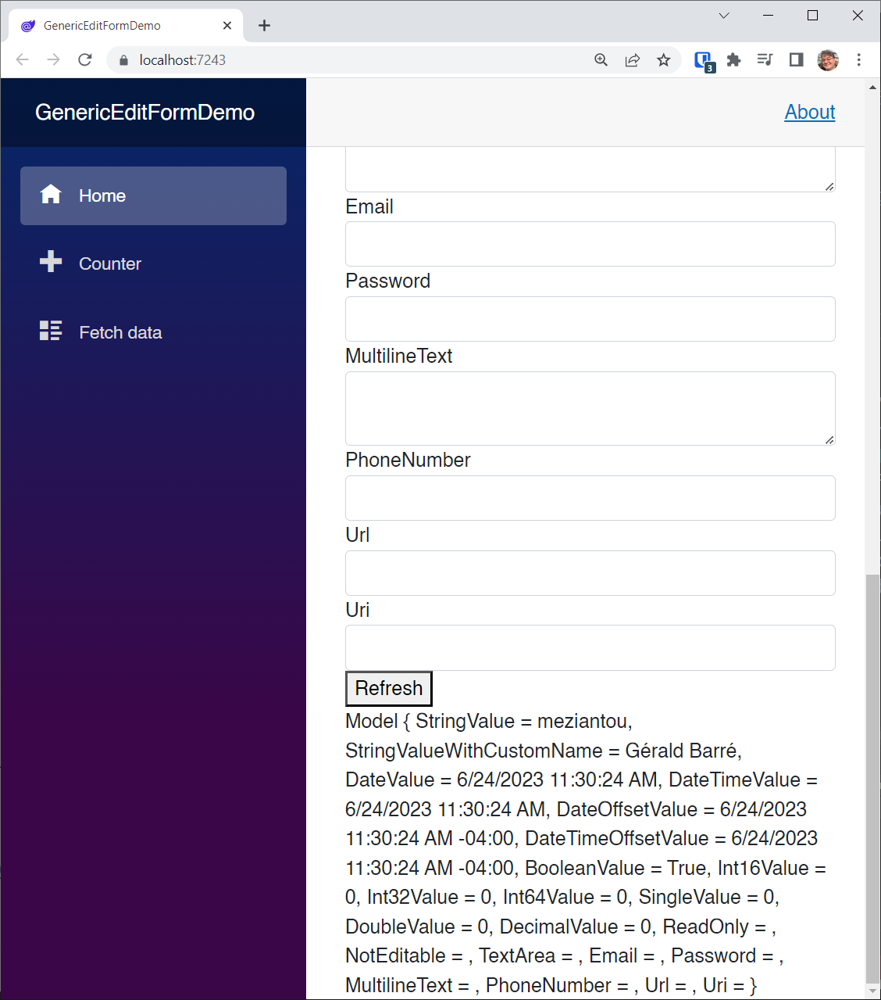

# Generic Components

In this module we'll be building components with generic types. This important because we want to be able to use them over and over again with different objects.

Without generic types there would be no third-party market for Blazor components. "Yes, I’d like a custom Data Grid for the Customer object please!" You see? Any component that you want to reuse with any kind of object must be written with generic types, and that means reflection.

`System.Reflection` is a namespace in .NET that lets you deal with types. Every object has a `GetType` method that returns a Type object. You can inspect the properties of that type, and you can read and write property values. 

Create a new **Blazor Server** project called **GenericComponentDemo**

To the *Shared* folder add a new Razor Component called *GenericComponent.razor*:

```c#
@typeparam TItem

<div>
    @DisplayMessage
</div>

@code {

    // The generic item we're working with
    [Parameter]
    public TItem Item { get; set; }

    // Name of the property to display
    [Parameter]
    public string TextPropertyName { get; set; }

    // Name of the property to treat as a value
    [Parameter]
    public string ValuePropertyName { get; set; }

    // read-only property to show in the markup
    string DisplayMessage
    {
        get
        {
            // Get a Type from TItem
            Type t = typeof(TItem);

            // Get the type's name: Person
            string name = t.Name;

            // Get the text PropertyInfo object using System.Reflection
            var textProperty = t.GetProperty(TextPropertyName);

            // Read the value of the Item object's text property
            string text = textProperty.GetValue(Item).ToString();

            // Do the same for the value property
            var valueProperty = t.GetProperty(ValuePropertyName);
            string value = valueProperty.GetValue(Item).ToString();

            // Display a string
            return $"The {name} object's {ValuePropertyName} value is" +
                    $" {value} and its {TextPropertyName} value is {text}";
        }
    }
}
```

Remember, reflection is the key here.

Check out the top line:

```c#
@typeparam TItem
```

This establishes the type that this component will be working with.

This is actually defined as a parameter in the @code block:

```c#
// The generic item we're working with
[Parameter]
public TItem Item { get; set; }
```

We also have two more parameters that identify the property names of this type: one for the text and one for the value:

```c#
// Name of the property to display
[Parameter]
public string TextPropertyName { get; set; }

// Name of the property to treat as a value
[Parameter]
public string ValuePropertyName { get; set; }
```

Don't get hung up on your object needing to have a value and a text property. All will be explained.

Check out the `DisplayMessage` read-only property:

```c#
// read-only property to show in the markup
string DisplayMessage
{
    get
    {
        // Get a Type from TItem
        Type t = typeof(TItem);

        // Get the type's name: Person
        string name = t.Name;

        // Get the text PropertyInfo object using System.Reflection
        var textProperty = t.GetProperty(TextPropertyName);

        // Read the value of the Item object's text property
        string text = textProperty.GetValue(Item).ToString();

        // Do the same for the value property
        var valueProperty = t.GetProperty(ValuePropertyName);
        string value = valueProperty.GetValue(Item).ToString();

        // Display a string
        return $"The {name} object's {ValuePropertyName} value is" +
            $" {value} and its {TextPropertyName} value is {text}";
    }
}
```

The first thing we do is get a `Type`object from `TItem`.

Now we can use reflection to pull out property values.

We return a string that shows that property names as specified in the parameters, and their values.

Now let's use this component.

Replace *Index.razor* with the following:

```c#
@page "/"

<PageTitle>Index</PageTitle>

<GenericComponent TItem="Person"
                  Item="@TestPerson"
                  TextPropertyName="Name"
                  ValuePropertyName="Id" />

@code
{
    Person TestPerson;

    public class Person
    {
        public int Id { get; set; }
        public string Name { get; set; }
    }

    protected override void OnInitialized()
    {
        TestPerson = new Person() { Id = 42, Name = "Carl Franklin" };
    }
}
```

Here we are instantiating the component with parameters that match the object we want the component to use.

Run the app.



Now that you know the basics of how to use the `typeparam` in a component, let's expand it a bit.

Replace *GenericComponent.razor* with the following:

```c#
@typeparam TItem

<style>
    .grid-row {
        display: grid;
        grid-template-columns: 50% 50%;
        padding: 4px;
        width: 25%;
    }

    .grid-left-item {
        padding: 4px;
        text-align: left;
    }

    .grid-right-item {
        padding: 4px;
        text-align: right;
    }
</style>

<h2>@ItemName Editor</h2>

<div>
    <div class="grid-row">
        <div class="grid-right-item">@ValuePropertyName:</div>
        <div class="grid-left-item"><input @bind="Value" /></div>
    </div>
    <div class="grid-row">
        <div class="grid-right-item">@TextPropertyName:</div>
        <div class="grid-left-item"><input @bind="Text" /></div>
    </div>
</div>
<br/>

@code {

    // The generic item we're working with
    [Parameter]
    public TItem Item { get; set; }

    // Name of the property to display
    [Parameter]
    public string TextPropertyName { get; set; }

    // Name of the property to treat as a value
    [Parameter]
    public string ValuePropertyName { get; set; }

    // Name of the type (Person)
    public string ItemName => Item.GetType().Name;

    // Generic Text property handler
    public string Text
    {
        get
        {
            return Item.GetType()
                .GetProperty(TextPropertyName)
                .GetValue(Item).ToString();
        }
        set
        {
            Item.GetType()
                .GetProperty(TextPropertyName)
                .SetValue(Item, value);
        }
    }

    // Generic Value property handler
    public int Value
    {
        get
        {
            return Convert.ToInt32(Item.GetType()
                .GetProperty(ValuePropertyName)
                .GetValue(Item));
        }
        set
        {
            Item.GetType()
                .GetProperty(ValuePropertyName)
                .SetValue(Item, value);
        }
    }

    // read-only property to show in the markup
    string DisplayMessage
    {
        get
        {
            // Get a Type from TItem
            Type t = typeof(TItem);

            // Get the type's name: Person
            string name = t.Name;

            // Get the text PropertyInfo object using System.Reflection
            var textProperty = t.GetProperty(TextPropertyName);

            // Read the value of the Item object's text property
            string text = textProperty.GetValue(Item).ToString();

            // Do the same for the value property
            var valueProperty = t.GetProperty(ValuePropertyName);
            string value = valueProperty.GetValue(Item).ToString();

            // Display a string
            return $"The {name} object's {ValuePropertyName} value is" +
                    $" {value} and its {TextPropertyName} value is {text}";
        }
    }
}
```

I've added a bit of in-line styling here so we can make a quick grid.

Check out this read-only property:

```c#
// Name of the type (Person)
public string ItemName => Item.GetType().Name;
```

That is bound (one-way) to this header at the top of the page

```html
<h2>@ItemName Editor</h2>
```

The really cool parts are the generic `Text` and `Value` property handlers.

```c#
// Generic Text property handler
public string Text
{
    get
    {
        return Item.GetType()
            .GetProperty(TextPropertyName)
            .GetValue(Item).ToString();
    }
    set
    {
        Item.GetType()
            .GetProperty(TextPropertyName)
            .SetValue(Item, value);
    }
}

// Generic Value property handler
public int Value
{
    get
    {
        return Convert.ToInt32(Item.GetType()
            .GetProperty(ValuePropertyName)
            .GetValue(Item));
    }
    set
    {
        Item.GetType()
            .GetProperty(ValuePropertyName)
            .SetValue(Item, value);
    }
}
```

They use `System.Reflection` to get and set the values of the specified properties.

That lets us bind them to UI elements, and we don't even know what the type is!

Check out the grid where we bind these properties:

```html
<div>
    <div class="grid-row">
        <div class="grid-right-item">@ValuePropertyName:</div>
        <div class="grid-left-item"><input @bind="Value" /></div>
    </div>
    <div class="grid-row">
        <div class="grid-right-item">@TextPropertyName:</div>
        <div class="grid-left-item"><input @bind="Text" /></div>
    </div>
</div>
```

Not only can we bind to the names of the properties, but the values themselves!

That's cool.



### Event Callbacks

It would be nice if the host component knew when the user changed one of the properties.

Let's handle that with an event.

Replace *GenericComponent.razor* with the following:

```c#
@typeparam TItem

<style>
    .grid-row {
        display: grid;
        grid-template-columns: 50% 50%;
        padding: 4px;
        width: 25%;
    }

    .grid-left-item {
        padding: 4px;
        text-align: left;
    }

    .grid-right-item {
        padding: 4px;
        text-align: right;
    }
</style>

<h2>@ItemName Editor</h2>

<div>
    <div class="grid-row">
        <div class="grid-right-item">@ValuePropertyName:</div>
        <div class="grid-left-item"><input @bind="Value" /></div>
    </div>
    <div class="grid-row">
        <div class="grid-right-item">@TextPropertyName:</div>
        <div class="grid-left-item"><input @bind="Text" /></div>
    </div>
</div>


@code {

    // The generic item we're working with
    [Parameter]
    public TItem Item { get; set; }

    // Name of the property to display
    [Parameter]
    public string TextPropertyName { get; set; }

    // Name of the property to treat as a value
    [Parameter]
    public string ValuePropertyName { get; set; }

    // Event callback for updates
    [Parameter]
    public EventCallback Updated { get; set; }

    // Name of the type (Person)
    public string ItemName
    {
        get
        {
            return Item.GetType().Name;
        }
    }

    // Generic Text property handler
    public string Text
    {
        get
        {
            return Item.GetType()
                .GetProperty(TextPropertyName)
                .GetValue(Item).ToString();
        }
        set
        {
            Item.GetType()
                .GetProperty(TextPropertyName)
                .SetValue(Item, value);
            Updated.InvokeAsync();
        }
    }

    // Generic Value property handler
    public int Value
    {
        get
        {
            return Convert.ToInt32(Item.GetType()
                .GetProperty(ValuePropertyName)
                .GetValue(Item));
        }
        set
        {
            Item.GetType()
                .GetProperty(ValuePropertyName)
                .SetValue(Item, value);
            Updated.InvokeAsync();
        }
    }

    // read-only property to show in the markup
    string DisplayMessage
    {
        get
        {
            // Get a Type from TItem
            Type t = typeof(TItem);

            // Get the type's name: Person
            string name = t.Name;

            // Get the text PropertyInfo object using System.Reflection
            var textProperty = t.GetProperty(TextPropertyName);

            // Read the value of the Item object's text property
            string text = textProperty.GetValue(Item).ToString();

            // Do the same for the value property
            var valueProperty = t.GetProperty(ValuePropertyName);
            string value = valueProperty.GetValue(Item).ToString();

            // Display a string
            return $"The {name} object's {ValuePropertyName} value is" +
                    $" {value} and its {TextPropertyName} value is {text}";
        }
    }
}
```

I've added this event callback parameter:

```c#
// Event callback for updates
[Parameter]
public EventCallback Updated { get; set; }
```

And then in the setters for the `Text` and `Value` properties, we raise it:

```c#
Updated.InvokeAsync();
```

Replace *Index.razor* with the following:

```c#
@page "/"

<PageTitle>Index</PageTitle>

<GenericComponent TItem="Person"
                  Item="@TestPerson"
                  TextPropertyName="Name"
                  ValuePropertyName="Id"
                  Updated="PersonUpdated" />

<h4>@DisplayString</h4>

@code
{
    Person TestPerson;
    string DisplayString = ""; 

    public class Person
    {
        public int Id { get; set; }
        public string Name { get; set; }
    }

    void PersonUpdated()
    {
        DisplayString = $"The Person object's Id value is" +
                    $" {TestPerson.Id} and its Text value is {TestPerson.Name}";
    }

    protected override void OnInitialized()
    {
        TestPerson = new Person() { Id = 42, Name = "Carl Franklin" };
        PersonUpdated();
    }
}
```

Run the app and make a couple changes.



## Generic Object Picker

Let's do something a little more complex. We'll create a generic component that lets you work with a list of objects, showing the available objects in a column on the left, and the selected objects in a column on the right, and then lets the user move items back and forth, effectively selecting a new list from the list of all the objects.

Create a **Blazor Server** application project called **ObjectPickerDemo**.

Add the following NuGet Package:

```xml
<ItemGroup>
    <PackageReference Include="AppvNext.ObjectPicker" Version="1.2.0" />
</ItemGroup>
```

> :point_up: You should always check for package updates when adding packages from repos such as this

Add the following to *_Imports.razor*:

```
@using AppvNext.ObjectPicker
```

Replace *Pages\Index.razor* with the following:

```c#
@page "/"

<h3>Select People</h3>
<div style="background-color:lightgray;padding:10px;">
    <ObjectPicker AllItems="AllPeople"
                  ItemTypePlural="People"
                  SelectedItems="SelectedPeople"
                  TextPropertyName="Name"
                  ValuePropertyName="Id"
                  TItem="Person"
                  ComponentUpdated="ObjectPicker_Updated" />
</div>
<span>@DisplayMessage</span>

@code
{

    List<Person> AllPeople;
    List<Person> SelectedPeople = new List<Person>();
    string DisplayMessage { get; set; } = "Selected: 0";

    public void ObjectPicker_Updated()
    {
        DisplayMessage = $"Selected: {SelectedPeople.Count}";
    }

    protected override void OnInitialized()
    {
        AllPeople = new List<Person>();
        AllPeople.Add(new Person { Id = 1, Name = "Isadora Jarr" });
        AllPeople.Add(new Person { Id = 2, Name = "Mike Easter" });
        AllPeople.Add(new Person { Id = 3, Name = "Ben Drinkin" });
        AllPeople.Add(new Person { Id = 4, Name = "Pikop Andropov" });
        SelectedPeople.Add(AllPeople[0]);
    }

    public class Person
    {
        public int Id { get; set; }
        public string Name { get; set; }
    }
}
```

TODO: Explain



TODO: Explain


Let's take a look at how ObjectPicker works

*ObjectPicker.razor*:

```c#
@typeparam TItem

<table style="width:100%">
    <tr>
        <td style="width:45%;" valign="top">
            All @ItemTypePlural<br />
        </td>
        <td style="width:10%;" valign="top">
            <span>&nbsp;</span>
        </td>
        <td style="width:45%;" valign="top">
            Selected @ItemTypePlural<br />
        </td>
    </tr>
    <tr>
        <td style="width:45%;" valign="top">
            <select @ondblclick="ItemDblClickedFromAllItems"
                    @onchange="ItemSelectedFromAllItems"
                              size="10" style="width:100%;">
                @foreach (var Item in AllItemsPrivate)
                {
                    if (@ItemValue(Item) == @ItemValue(SelectedItem))
                    {
                        <option selected value="@ItemValue(Item)">
                            @ItemText(Item)
                        </option>
                    }
                    else
                    {
                        <option value="@ItemValue(Item)">
                            @ItemText(Item)
                        </option>
                    }
                }
            </select>
        </td>
        <td style="width:10%;" valign="top">
            <button @onclick="AddSelectedItem"
                              type="button"
                              disabled="@AddSelectedItemButtonDisabled"
                              style="width:100%;">
                &gt;
            </button><br />
            <button @onclick="@AddAllItems"
                              type="button"
                              style="width:100%;">
                &gt;&gt;
            </button><br />
            <button @onclick="@RemoveSelectedItem"
                              type="button"
                              disabled="@RemoveSelectedItemButtonDisabled"
                              style="width:100%;">
                &lt;
            </button><br />
            <button @onclick="@RemoveAllItems"
                              type="button"
                              style="width:100%;">
                &lt;&lt;
            </button><br />
        </td>
        <td style="width:45%;" valign="top">
            <select @ondblclick="ItemDblClickedFromSelectedItems"
                    @onchange="ItemSelectedFromSelectedItems"
                              size="10" style="width:100%;">
                @foreach (var Item in SelectedItems)
                {
                    if (@ItemValue(Item) == @ItemValue(SelectedItem))
                    {
                        <option selected value="@ItemValue(Item)">
                            @ItemText(Item)
                        </option>
                    }
                    else
                    {
                        <option value="@ItemValue(Item)">
                            @ItemText(Item)
                        </option>
                    }
                }
            </select>
        </td>
    </tr>
</table>
```

TODO: Explain


*ObjectPicker.razor.cs*:

```c#
using System;
using System.Collections.Generic;
using System.Linq;
using Microsoft.AspNetCore.Components;

namespace AppvNext.ObjectPicker
{
    public partial class ObjectPicker<TItem> : ComponentBase
    {
        [Parameter]
        public string ItemTypePlural { get; set; }

        [Parameter]
        public string TextPropertyName { get; set; }

        [Parameter]
        public string ValuePropertyName { get; set; }

        [Parameter]
        public List<TItem> AllItems { get; set; }

        [Parameter]
        public List<TItem> SelectedItems { get; set; }

        [Parameter]
        public EventCallback ComponentUpdated { get; set; }

        protected TItem SelectedItem { get; set; }
        protected List<TItem> AllItemsPrivate { get; set; }
        protected bool AddSelectedItemButtonDisabled = true;
        protected bool RemoveSelectedItemButtonDisabled = true;

        protected string ItemValue(TItem Item)
        {
            return Item.GetType()
            .GetProperty(ValuePropertyName)
            .GetValue(Item, null)
            .ToString();
        }

        protected string ItemText(TItem Item)
        {
            return Item.GetType()
            .GetProperty(TextPropertyName)
            .GetValue(Item, null)
            .ToString();
        }

        protected override void OnParametersSet()
        {
            // make a copy of the items
            AllItemsPrivate = AllItems.ToArray().ToList();

            if (AllItemsPrivate.Count > 0)
            {
                // remove the items that exist in SelectedItems
                foreach (var item in SelectedItems)
                {
                    var id = item.GetType()
                    .GetProperty(ValuePropertyName)
                    .GetValue(item, null)
                    .ToString();

                    var ItemFromAllItems =
                    (from x in AllItemsPrivate
                     where x.GetType()
                     .GetProperty(ValuePropertyName)
                     .GetValue(x, null)
                     .ToString() == id
                     select x).FirstOrDefault();

                    if (ItemFromAllItems != null)
                    {
                        AllItemsPrivate.Remove(ItemFromAllItems);
                    }
                }

            }
            if (AllItemsPrivate.Count > 0)
            {
                SelectedItem = AllItemsPrivate.First();
            }
            else if (SelectedItems.Count > 0)
            {
                SelectedItem = SelectedItems.First();
            }
            UpdateButtonEnabledStates();
        }

        protected void ItemSelectedFromAllItems(ChangeEventArgs args)
        {
            SelectedItem =
            (from x in AllItemsPrivate
             where x.GetType()
         .GetProperty(ValuePropertyName)
         .GetValue(x, null)
         .ToString() == args.Value.ToString()
             select x).FirstOrDefault();

            UpdateButtonEnabledStates();
        }

        protected void UpdateButtonEnabledStates()
        {
            AddSelectedItemButtonDisabled = !AllItemsPrivate.Contains(SelectedItem);
            RemoveSelectedItemButtonDisabled = !SelectedItems.Contains(SelectedItem);
        }

        protected void AddAllItems()
        {
            foreach (var Item in AllItemsPrivate.ToArray())
            {
                SelectedItems.Add(Item);
            }
            if (SelectedItems.Count > 0)
            {
                SelectedItem = SelectedItems.First();
            }
            AllItemsPrivate.Clear();
            UpdateButtonEnabledStates();
            ComponentUpdated.InvokeAsync().Wait();
        }

        protected void RemoveAllItems()
        {
            foreach (var Item in SelectedItems.ToArray())
            {
                AllItemsPrivate.Add(Item);
            }
            if (AllItemsPrivate.Count > 0)
            {
                SelectedItem = AllItemsPrivate.First();
            }
            SelectedItems.Clear();
            UpdateButtonEnabledStates();
            ComponentUpdated.InvokeAsync().Wait();
        }

        protected void AddSelectedItem()
        {
            if ((from x in SelectedItems
                 where ItemValue(x) == ItemValue(SelectedItem)
                 select x).FirstOrDefault() == null)
            {
                SelectedItems.Add(SelectedItem);
                AllItemsPrivate.Remove(SelectedItem);
                UpdateButtonEnabledStates();
                ComponentUpdated.InvokeAsync().Wait();
            }
        }

        protected void RemoveSelectedItem()
        {
            if ((from x in AllItemsPrivate
                 where ItemValue(x) == ItemValue(SelectedItem)
                 select x).FirstOrDefault() == null)
            {
                AllItemsPrivate.Add(SelectedItem);
                SelectedItems.Remove(SelectedItem);
                UpdateButtonEnabledStates();
                ComponentUpdated.InvokeAsync().Wait();
            }
        }

        protected void ItemSelectedFromSelectedItems(ChangeEventArgs args)
        {
            SelectedItem =
            (from x in SelectedItems
             where x.GetType()
             .GetProperty(ValuePropertyName)
             .GetValue(x, null)
             .ToString() == args.Value.ToString()
             select x
            ).FirstOrDefault();
            UpdateButtonEnabledStates();
        }

        protected void ItemDblClickedFromAllItems()
        {
            AddSelectedItem();
        }

        protected void ItemDblClickedFromSelectedItems()
        {
            RemoveSelectedItem();
        }

    }
}
```

TODO: Explain

## Generic Edit Forms

TODO: Explain

Create a new **Blazor Server** application project called **GenericEditFormDemo**

Add the following NuGet Package:

```xml
<ItemGroup>
    <PackageReference Include="Meziantou.AspNetCore.Components" Version="2.0.9" />
</ItemGroup>
```

Add the following to *_Imports.razor*:

```
@using Meziantou.AspNetCore.Components
@using System.ComponentModel.DataAnnotations
@using System.ComponentModel
```

Replace *Pages\Index.razor* with the following:

```c#
@page "/"
@*
    I learned about this guy and his code from a Bing search, landing here:
    https://www.meziantou.net/automatically-generate-a-form-from-an-object-in-blazor.htm
*@

<h1>Generic Form!</h1>

<EditForm Model="MyModel">
    <DataAnnotationsValidator />
    <ValidationSummary />
    <GenericForm @bind-Model="MyModel" 
                 EditorClass="form-control" 
                 EnableFieldValidation="false">
        <FieldTemplate Context="field">
            <div class="form-group">
                <label for="@field.EditorId">@field.DisplayName</label>
                @field.EditorTemplate
                @field.FieldValidationTemplate
            </div>
        </FieldTemplate>
    </GenericForm>
</EditForm>

<button type="button" @onclick="() => StateHasChanged()">Refresh</button>

<div>
    @MyModel
</div>

@code
{

    public Model MyModel { get; set; } = new Model();

    public record Model
    {
        [MinLength(3)]
        [Display(Name = "String Value with custom name")]
        public string StringValue { get; set; } = "meziantou";

        [DisplayName("Custom name")]
        public string StringValueWithCustomName { get; set; } = "Gérald Barré";

        [DataType(DataType.Date)]
        public DateTime DateValue { get; set; } = DateTime.Now;

        public DateTime DateTimeValue { get; set; } = DateTime.Now;

        [DataType(DataType.Date)]
        public DateTimeOffset DateOffsetValue { get; set; } = DateTimeOffset.Now;

        public DateTimeOffset DateTimeOffsetValue { get; set; } = DateTimeOffset.Now;

        public bool BooleanValue { get; set; } = true;

        public short Int16Value { get; set; }

        public int Int32Value { get; set; }

        public long Int64Value { get; set; }

        public float SingleValue { get; set; }

        public double DoubleValue { get; set; }

        public decimal DecimalValue { get; set; }

        // This is not visible in the form
        public string ReadOnly { get; }

        // This is not visible in the form
        [Editable(false)]
        public string NotEditable { get; }

        [Editor(typeof(InputTextArea), typeof(InputBase<>))]
        public string TextArea { get; set; }

        [DataType(DataType.EmailAddress)]
        public string Email { get; set; }

        [DataType(DataType.Password)]
        public string Password { get; set; }

        [DataType(DataType.MultilineText)]
        public string MultilineText { get; set; }

        [DataType(DataType.PhoneNumber)]
        public string PhoneNumber { get; set; }

        [DataType(DataType.Url)]
        public string Url { get; set; }

        public Uri Uri { get; set; }
    }
}
```

TODO: Explain



Scroll to the bottom to view the values of each property in the model:



TODO: Explain

> For more information on Generic Types see BlazorTrain episode 52 at https://www.youtube.com/watch?v=jmGPUu2_t1U

